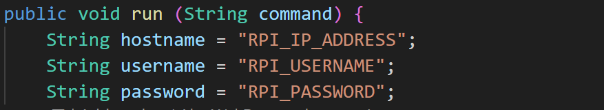
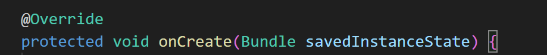
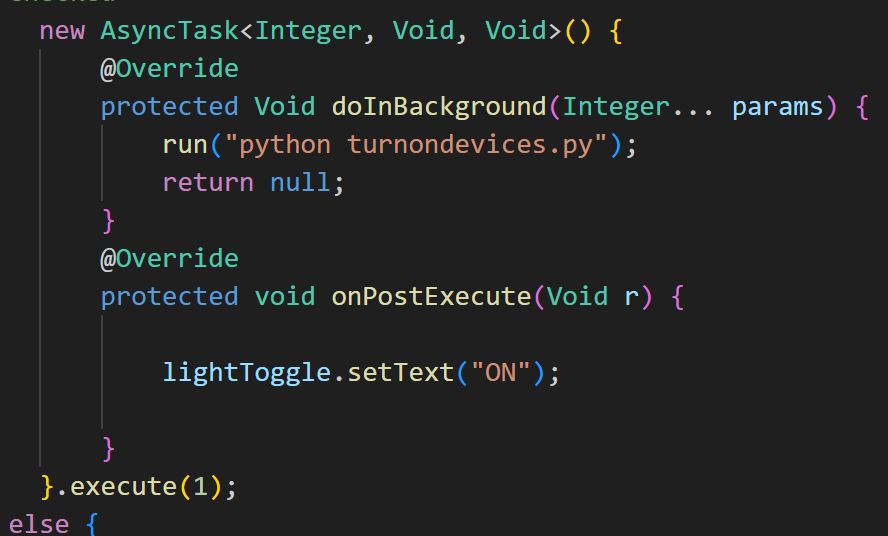

### This is for Lab2 OF IoT Course, Please follow IoTLab2.pdf manuals first, while you reaches the procedure of creating the Android App, you need to read this file before you dive in.

1. Please noticed the IoTLab2App is your Andorid Studio file, do not change any file haven't metioned here.


2. In funtion: 

    change the parameters with your Raspberry pi.

    `RPI_IP_Address` can be found by command: `hostname -I`

    `RPI_USERNAME` is the username of Raspberry pi we give you during the lab.

    `RPI_PASSWORD` is the password or Raspberry pi we give you during the lab.


3. In function: 

    Find the Definition with this kind of format:


    In the `run("")`, you need to add the python script you want to running in Raspberry Pi, the syntax is:

    `python The python script name`


    **Please make sure all the scripts are in `/home/[username]` or `~/`**

    eg: my raspberry pi username is: iotlab2025 I want to running `trunon.py`, so i put script in `/home/iotlab2025`, also you can put script your in `~/` (The `~` means `/home/iotlab2025`), and then run method is like `run("python turnon.py")`

4. The ssh.jar is very old version so Raspberry pi has not support it, please read the instructions below:


(1). Open the commandline in Raspberry pi copy them and paste them to run.

```bash 
echo 'KexAlgorithms +diffie-hellman-group14-sha1

HostkeyAlgorithms +ssh-rsa

PubkeyAcceptedAlgorithms +ssh-rsa

MACs +hmac-sha1

Ciphers +aes128-ctr,aes192-ctr,aes256-ctr' | sudo tee /etc/ssh/sshd_config.d/legacy.conf
```

Rememeber to make sure use `\` while your command has multipul lines. 

(2). Check and reboot the ssh service.

`sudo sshd -t`   # if no outputs, the setting is good enough
`sudo systemctl` #restart ssh
